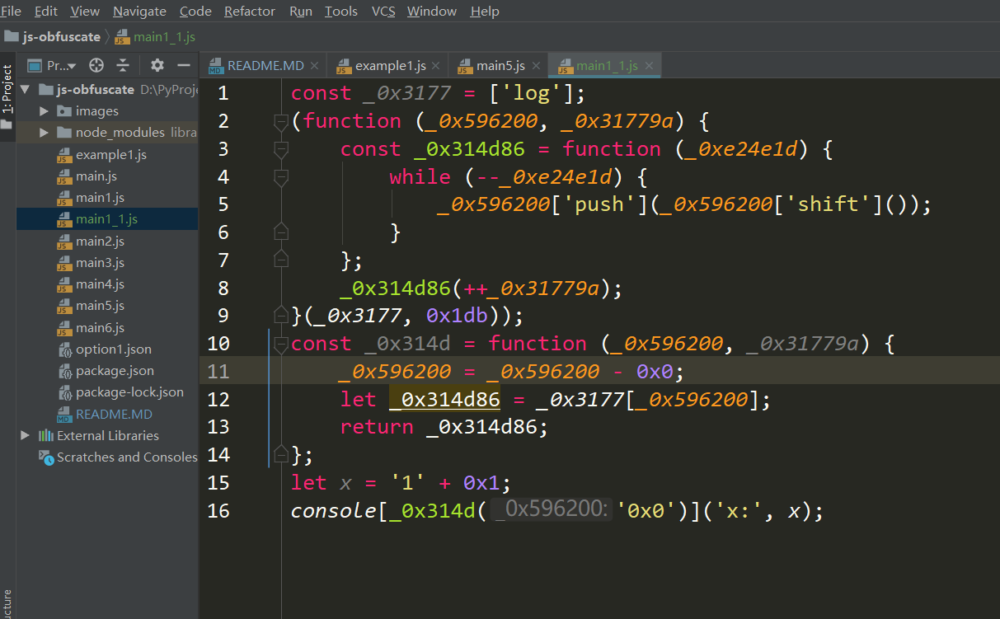
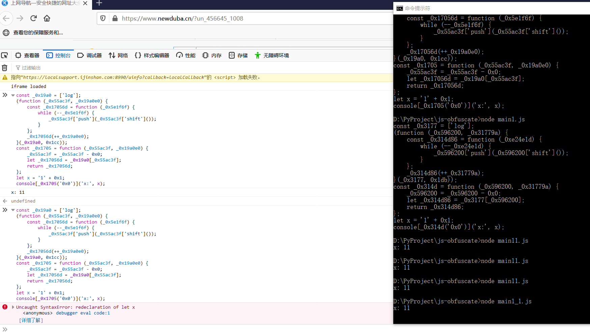

## javascript-obfuscator 库使用

# 1 javascript-obfuscator 安装启动
- 运行环境：Node.js 电脑直接搜索安装
- Node.js 介绍：
    - 简单的说 Node.js 就是运行在客户端的 JavaScript。
    - Node.js 语法和JavaScript几乎一样。
    - Node.js 是一个基于Chrome JavaScript 运行时建立的一个平台。
    - Node.js是一个事件驱动I/O服务端JavaScript环境，基于Google的V8引擎，V8引擎执行Javascript的速度非常快，性能非常好。
    - Node.js教程：https://www.runoob.com/nodejs/nodejs-tutorial.html
    - 安装了Node.js，使用node命令初始化一个项目，项目中的JavaScript文件就可以本地执行
    - CMD进入项目文件夹中，node main.js 就可以本地运行js文件
    - 安装 Node.js 后，就可以使用 npm 命令进行各种操作

- 初始化项目
    - 1.新建一个文件夹，比如 js-obfuscate，随后CMD窗口进入该文件夹，初始化工作空间：
        - 执行命令：npm init
        - 
    - 2.然后根据提示输入一些配置信息，创建一个 package.json 文件
        - 参考图片
        - 参考网址npm init初始化项目配置信息说明：https://www.cnblogs.com/WD-NewDemo/p/11141384.html
        - 如果我们在进行package.json文件配置的时候写错了东西，或者后期要添加什么内容的话，我们是可以直接在项目的根目录中打开然后进行修改
    - 3.安装 javascript-obfuscator 这个库：
        - 当前 js-obfuscate 项目文件夹下执行命令
        - npm install --save-dev javascript-obfuscator
        - 
        - npm javascript-obfuscator -v 查看当前版本号
    - 4.pycharm软件打开 js-obfuscate 项目文件夹
        - 项目文件夹下创建 JavaScript 类型文件即可
        - 新建一个main.js文件，具体查看js-obfuscate项目文件夹
        - main.js 是原始代码，main1.js 是代码混淆过程，执行的结果就是混淆后的代码
        - 然后CMD窗口切换到项目文件夹下执行运行命令：node main1.js
        - 输出结果就是混淆后的代码
        - 混淆后代码，逻辑混乱直接读是无法理解的
        - 
        - 混淆代码使用了控制流扁平化的选项，打乱函数原有代码执行流程及函数调用关系，使代码逻变得混乱无序
    
- 注意1：
    - 代码混淆后，每次运行的结果都是不同的，直接读是不能理解的
    - 混淆后代码有很多function函数，是依赖混淆库，浏览器执行反解码用的
    - 混淆后的代码可以直接复制到浏览器调试端运行(同一个代码运行第二次会报错？)
    - 混淆后的代码可以单独存储为JavaScript文件，然后CMD中node环境下运行
    - 参考main1.js main1_1.js 
    - 
    - 
    
- 注意2:
    - 要混淆的代码格式
    - 方式1（推荐）：
        - 使用tab键上面的引号，实现类似于python中双引号功能，
        - 里面可以书写大量带格式代码（直接复制js代码放到一对引号里面就可以了）,推荐使用,参考main9.js
        - 代码保持原始JavaScript代码格式，不需要转义反斜杠
    - 方式2：
        - 定义为code变量，然后代码放在普通双引号中，所有代码写在一行不要换行
        - 代码保持JavaScript格式，代码中间使用 ; 分隔，末尾的 ; 符号保留，就是保持JavaScript格式，只是写成一行
        - 参考main7.js
    - 方式3：
        - 要换行写，需要使用 + 号连接，每一行单独放在双引号中
        - 参考main1.js
   
# 2 代码控制流平坦化和代码压缩
- 代码压缩
    - 参数 compact 即可完成 JavaScript 代码的压缩，输出为一行内容。
    - 默认是 true，如果定义为 false，则混淆后的代码会分行显示。
- 代码控制流平坦化
    - 参数 controlFlowFlattening ， 该参数默认不写，该混淆库默认false
    - 打乱函数原有代码执行流程及函数调用关系，使代码逻变得混乱无序。
    - 设置为false, 函数逻辑还是保持不变的，参考main7.js main8.js

- 参考代码
    - main.js 原始 js 代码
    - main1.js 代码控制流扁平化(代码打乱重新编码)和代码不压缩一行
    - main2.js 代码控制流扁平化和代码压缩一行  

# 3 变量名混淆
- 变量名混淆可以通过配置 identifierNamesGenerator 参数实现，
- 我们通过这个参数可以控制变量名混淆的方式，
- 如 hexadecimal 则会替换为 16 进制形式的字符串，在这里我们可以设定如下值：
    - hexadecimal：将变量名替换为 16 进制形式的字符串，如 0xabc123。
    - mangled：将变量名替换为普通的简写字符，如 a、b、c 等。
    - 该参数默认为 hexadecimal。 
    - 查看 main3 main4 案例
    - 选用了 mangled，其代码体积会更小，但 hexadecimal 其可读性会更低
    
-  identifiersPrefix 参数来控制混淆后的变量前缀，可以自定义前缀
    - 查看 main5 案例

-  renameGlobals 这个参数还可以指定是否混淆全局变量和函数名称，默认为 false
    - 这个参数可能导致代码执行不通，尽量不要使用
    
# 4 字符串混淆
- 字符串混淆，即将一个字符串声明放到一个数组里面，使之无法被直接搜索到。
    - stringArray 参数来控制字符串混淆，默认为 true，该参数不写默认就是 true
    - rotateStringArray 参数来控制数组化后结果的元素顺序，默认为 true。
    - stringArrayEncoding 参数来控制数组的编码形式，默认不开启编码，
        - 如果设置为 true 或 base64，则会使用 Base64 编码，
        - 如果设置为 rc4，则使用 RC4 编码。
    - stringArrayThreshold 来控制启用编码的概率，范围 0 到 1，默认 0.8。
    - unicodeEscapeSequence 这个参数对字符串进行 Unicode 转码，字符串被数字化和 Unicode 化, 使之更加难以辨认

- stringArray 参数必须默认开启，字符串不混淆，上面代码控制流平坦化、代码压缩、变量名混淆都是在字符串混淆基础上进行的
- stringArray 参数设置为 false 输出的代码就是原始代码

- JavaScript 逆向的过程中，一些关键的字符串可能会作为切入点来查找加密入口。
- 用了这种混淆之后，如果有人想通过全局搜索的方式搜索 hello 这样的字符串找加密入口，字符串都被替换了，也没法搜到了
      
# 5 代码自我保护
- 通过设置 selfDefending 参数来开启代码自我保护功能。默认false,开启时true
- 开启之后，混淆后的 JavaScript 会强制以一行形式显示，
- 如果我们将混淆后的代码进行格式化（美化）或者重命名，该段代码将无法执行。

# 6 控制流平坦化
- 控制流平坦化其实就是将代码的执行逻辑混淆，使其变得复杂难读。
- 其基本思想是将一些逻辑处理块都统一加上一个前驱逻辑块，
- 每个逻辑块都由前驱逻辑块进行条件判断和分发，构成一个个闭环逻辑，导致整个执行逻辑十分复杂难读。
- 通过 controlFlowFlattening 变量可以控制是否开启控制流平坦化
    - 该参数，默认是false，开启true
    - 一些连续的执行逻辑被打破，代码被修改为一个 switch 语句，我们很难再一眼看出多条 console.log 语句的执行顺序了。
    - 查看案例main7.js main7_1.js

    - 如果我们将 controlFlowFlattening 设置为 false 或者不设置，仍然保留了原始的 console.log 执行逻辑
    - 查看案例main8.js main8_1.js

- 补充：
    - 使用控制流扁平化可以使得执行逻辑更加复杂难读，目前非常多的前端混淆都会加上这个选项。
    - 但启用控制流扁平化之后，代码的执行时间会变长，最长达 1.5 倍之多。
    - 另外我们还能使用 controlFlowFlatteningThreshold 这个参数来控制比例，取值范围是 0 到 1，默认 0.75，
    - 如果设置为 0，那相当于 controlFlowFlattening 设置为 false，即不开启控制流扁平化 。
    
# 7 僵尸代码注入
- 僵尸代码即不会被执行的代码或对上下文没有任何影响的代码，注入之后可以对现有的 JavaScript 代码的阅读形成干扰。
- 我们可以使用 deadCodeInjection 参数开启这个选项，默认为 false。
- 代码中会增加了一些不会执行到的逻辑区块内容，本来没有的条件语句，混淆视听。

- deadCodeInjectionThreshold 参数来控制僵尸代码注入的比例，取值 0 到 1，默认是 0.4。

# 8 禁用控制台输出
- 可以使用 disableConsoleOutput 来禁用掉 console.log 输出功能，加大调试难度
- 混淆后的代码，里面含有 console.log 代码，控制台执行时候是没有输出结果的
- 直接 node 环境运行混淆后的代码，console.log 也是不会输出结果的
```javascript
const code = `
console.log('hello world')
`
const options = {
    disableConsoleOutput: true
}
```

# 9 调试保护
- 我们可以使用 debugProtection 来禁用调试模式，进入无限 Debug 模式。
- 另外我们还可以使用 debugProtectionInterval 来启用无限 Debug 的间隔，
- 使得代码在调试过程中会不断进入断点模式，无法顺畅执行。
```javascript
const code = `
for (let i = 0; i < 5; i ++) {
    console.log('i', i)
}
`
const options = {
    debugProtection: true
}
```

# 10 域名锁定
- 我们可以通过控制 domainLock 来控制 JavaScript 代码只能在特定域名下运行，这样就可以降低被模拟的风险。
```javascript
const code = `
console.log('hello world')
`
const options = {
    domainLock: ['baidu.com']
}
```

# 11 特殊编码
- 另外还有一些特殊的工具包，如使用 aaencode、jjencode、jsfuck 等工具对代码进行混淆和编码。
- 混淆方式比较另类，但只需要输入到控制台即可执行，其没有真正达到强力混淆的效果。
- 代码经过编码后变成特殊的字符
```javascript
var a = 1

// 上面代码经过jsfuck、aaencode、jjencode编码后的结果
// [][(![]+[])[!+[]+!![]+!![]]+([]+{})[+!![]]+(!![]+[])[+!![]]+(!![]+[])[+[]]][([]+{})[!+[]+!![]+!![]+!![]+!![]]+([]+{})[+!![]]+([][[]]+[])[+!![]]+(![]+[])[!+[]+!![]+!![]]+(!![]+[])[+[]]+(!![]+[])[+!![]]+([][[]]+[])[+[]]+([]+{})[!+[]+!![]+!![]+!![]+!![]]+(!![]+[])[+[]]+([]+{})[+!![]]+(!![]+[])[+!![]]]([][(![]+[])[!+[]+!![]+!![]]+([]+{})[+!![]]+(!![]+[])[+!![]]+(!![]+[])[+[]]][([]+{})[!+[]+!![]+!![]+!![]+!![]]+([]+{})[+!![]]+([][[]]+[])[+!![]]+(![]+[])[!+[]+!![]+!![]]+(!![]+[])[+[]]+(!![]+[])[+!![]]+([][[]]+[])[+[]]+([]+{})[!+[]+!![]+!![]+!![]+!![]]+(!![]+[])[+[]]+([]+{})[+!![]]+(!![]+[])[+!![]]]((!![]+[])[+!![]]+([][[]]+[])[!+[]+!![]+!![]]+(!![]+[])[+[]]+([][[]]+[])[+[]]+(!![]+[])[+!![]]+([][[]]+[])[+!![]]+([]+{})[!+[]+!![]+!![]+!![]+!![]+!![]+!![]]+([][[]]+[])[+[]]+([][[]]+[])[+!![]]+([][[]]+[])[!+[]+!![]+!![]]+(![]+[])[!+[]+!![]+!![]]+([]+{})[!+[]+!![]+!![]+!![]+!![]]+(+{}+[])[+!![]]+([]+[][(![]+[])[!+[]+!![]+!![]]+([]+{})[+!![]]+(!![]+[])[+!![]]+(!![]+[])[+[]]][([]+{})[!+[]+!![]+!![]+!![]+!![]]+([]+{})[+!![]]+([][[]]+[])[+!![]]+(![]+[])[!+[]+!![]+!![]]+(!![]+[])[+[]]+(!![]+[])[+!![]]+([][[]]+[])[+[]]+([]+{})[!+[]+!![]+!![]+!![]+!![]]+(!![]+[])[+[]]+([]+{})[+!![]]+(!![]+[])[+!![]]]((!![]+[])[+!![]]+([][[]]+[])[!+[]+!![]+!![]]+(!![]+[])[+[]]+([][[]]+[])[+[]]+(!![]+[])[+!![]]+([][[]]+[])[+!![]]+([]+{})[!+[]+!![]+!![]+!![]+!![]+!![]+!![]]+(![]+[])[!+[]+!![]]+([]+{})[+!![]]+([]+{})[!+[]+!![]+!![]+!![]+!![]]+(+{}+[])[+!![]]+(!![]+[])[+[]]+([][[]]+[])[!+[]+!![]+!![]+!![]+!![]]+([]+{})[+!![]]+([][[]]+[])[+!![]])(!+[]+!![]+!![]+!![]+!![]))[!+[]+!![]+!![]]+([][[]]+[])[!+[]+!![]+!![]])(!+[]+!![]+!![]+!![])([][(![]+[])[!+[]+!![]+!![]]+([]+{})[+!![]]+(!![]+[])[+!![]]+(!![]+[])[+[]]][([]+{})[!+[]+!![]+!![]+!![]+!![]]+([]+{})[+!![]]+([][[]]+[])[+!![]]+(![]+[])[!+[]+!![]+!![]]+(!![]+[])[+[]]+(!![]+[])[+!![]]+([][[]]+[])[+[]]+([]+{})[!+[]+!![]+!![]+!![]+!![]]+(!![]+[])[+[]]+([]+{})[+!![]]+(!![]+[])[+!![]]]((!![]+[])[+!![]]+([][[]]+[])[!+[]+!![]+!![]]+(!![]+[])[+[]]+([][[]]+[])[+[]]+(!![]+[])[+!![]]+([][[]]+[])[+!![]]+([]+{})[!+[]+!![]+!![]+!![]+!![]+!![]+!![]]+([][[]]+[])[!+[]+!![]+!![]]+(![]+[])[!+[]+!![]+!![]]+([]+{})[!+[]+!![]+!![]+!![]+!![]]+(+{}+[])[+!![]]+([]+[][(![]+[])[!+[]+!![]+!![]]+([]+{})[+!![]]+(!![]+[])[+!![]]+(!![]+[])[+[]]][([]+{})[!+[]+!![]+!![]+!![]+!![]]+([]+{})[+!![]]+([][[]]+[])[+!![]]+(![]+[])[!+[]+!![]+!![]]+(!![]+[])[+[]]+(!![]+[])[+!![]]+([][[]]+[])[+[]]+([]+{})[!+[]+!![]+!![]+!![]+!![]]+(!![]+[])[+[]]+([]+{})[+!![]]+(!![]+[])[+!![]]]((!![]+[])[+!![]]+([][[]]+[])[!+[]+!![]+!![]]+(!![]+[])[+[]]+([][[]]+[])[+[]]+(!![]+[])[+!![]]+([][[]]+[])[+!![]]+([]+{})[!+[]+!![]+!![]+!![]+!![]+!![]+!![]]+(![]+[])[!+[]+!![]]+([]+{})[+!![]]+([]+{})[!+[]+!![]+!![]+!![]+!![]]+(+{}+[])[+!![]]+(!![]+[])[+[]]+([][[]]+[])[!+[]+!![]+!![]+!![]+!![]]+([]+{})[+!![]]+([][[]]+[])[+!![]])(!+[]+!![]+!![]+!![]+!![]))[!+[]+!![]+!![]]+([][[]]+[])[!+[]+!![]+!![]])(!+[]+!![]+!![]+!![]+!![])(([]+{})[+[]])[+[]]+(!+[]+!![]+!![]+!![]+!![]+!![]+!![]+[])+(!+[]+!![]+!![]+!![]+!![]+!![]+[]))+(+{}+[])[+!![]]+(!![]+[])[+!![]]+([]+{})[!+[]+!![]+!![]+!![]+!![]+!![]+!![]]+(+{}+[])[+!![]]+([]+{})[!+[]+!![]+!![]+!![]+!![]+!![]+!![]]+[][(![]+[])[!+[]+!![]+!![]]+([]+{})[+!![]]+(!![]+[])[+!![]]+(!![]+[])[+[]]][([]+{})[!+[]+!![]+!![]+!![]+!![]]+([]+{})[+!![]]+([][[]]+[])[+!![]]+(![]+[])[!+[]+!![]+!![]]+(!![]+[])[+[]]+(!![]+[])[+!![]]+([][[]]+[])[+[]]+([]+{})[!+[]+!![]+!![]+!![]+!![]]+(!![]+[])[+[]]+([]+{})[+!![]]+(!![]+[])[+!![]]]((!![]+[])[+!![]]+([][[]]+[])[!+[]+!![]+!![]]+(!![]+[])[+[]]+([][[]]+[])[+[]]+(!![]+[])[+!![]]+([][[]]+[])[+!![]]+([]+{})[!+[]+!![]+!![]+!![]+!![]+!![]+!![]]+([][[]]+[])[+[]]+([][[]]+[])[+!![]]+([][[]]+[])[!+[]+!![]+!![]]+(![]+[])[!+[]+!![]+!![]]+([]+{})[!+[]+!![]+!![]+!![]+!![]]+(+{}+[])[+!![]]+([]+[][(![]+[])[!+[]+!![]+!![]]+([]+{})[+!![]]+(!![]+[])[+!![]]+(!![]+[])[+[]]][([]+{})[!+[]+!![]+!![]+!![]+!![]]+([]+{})[+!![]]+([][[]]+[])[+!![]]+(![]+[])[!+[]+!![]+!![]]+(!![]+[])[+[]]+(!![]+[])[+!![]]+([][[]]+[])[+[]]+([]+{})[!+[]+!![]+!![]+!![]+!![]]+(!![]+[])[+[]]+([]+{})[+!![]]+(!![]+[])[+!![]]]((!![]+[])[+!![]]+([][[]]+[])[!+[]+!![]+!![]]+(!![]+[])[+[]]+([][[]]+[])[+[]]+(!![]+[])[+!![]]+([][[]]+[])[+!![]]+([]+{})[!+[]+!![]+!![]+!![]+!![]+!![]+!![]]+(![]+[])[!+[]+!![]]+([]+{})[+!![]]+([]+{})[!+[]+!![]+!![]+!![]+!![]]+(+{}+[])[+!![]]+(!![]+[])[+[]]+([][[]]+[])[!+[]+!![]+!![]+!![]+!![]]+([]+{})[+!![]]+([][[]]+[])[+!![]])(!+[]+!![]+!![]+!![]+!![]))[!+[]+!![]+!![]]+([][[]]+[])[!+[]+!![]+!![]])(!+[]+!![]+!![]+!![])([][(![]+[])[!+[]+!![]+!![]]+([]+{})[+!![]]+(!![]+[])[+!![]]+(!![]+[])[+[]]][([]+{})[!+[]+!![]+!![]+!![]+!![]]+([]+{})[+!![]]+([][[]]+[])[+!![]]+(![]+[])[!+[]+!![]+!![]]+(!![]+[])[+[]]+(!![]+[])[+!![]]+([][[]]+[])[+[]]+([]+{})[!+[]+!![]+!![]+!![]+!![]]+(!![]+[])[+[]]+([]+{})[+!![]]+(!![]+[])[+!![]]]((!![]+[])[+!![]]+([][[]]+[])[!+[]+!![]+!![]]+(!![]+[])[+[]]+([][[]]+[])[+[]]+(!![]+[])[+!![]]+([][[]]+[])[+!![]]+([]+{})[!+[]+!![]+!![]+!![]+!![]+!![]+!![]]+([][[]]+[])[!+[]+!![]+!![]]+(![]+[])[!+[]+!![]+!![]]+([]+{})[!+[]+!![]+!![]+!![]+!![]]+(+{}+[])[+!![]]+([]+[][(![]+[])[!+[]+!![]+!![]]+([]+{})[+!![]]+(!![]+[])[+!![]]+(!![]+[])[+[]]][([]+{})[!+[]+!![]+!![]+!![]+!![]]+([]+{})[+!![]]+([][[]]+[])[+!![]]+(![]+[])[!+[]+!![]+!![]]+(!![]+[])[+[]]+(!![]+[])[+!![]]+([][[]]+[])[+[]]+([]+{})[!+[]+!![]+!![]+!![]+!![]]+(!![]+[])[+[]]+([]+{})[+!![]]+(!![]+[])[+!![]]]((!![]+[])[+!![]]+([][[]]+[])[!+[]+!![]+!![]]+(!![]+[])[+[]]+([][[]]+[])[+[]]+(!![]+[])[+!![]]+([][[]]+[])[+!![]]+([]+{})[!+[]+!![]+!![]+!![]+!![]+!![]+!![]]+(![]+[])[!+[]+!![]]+([]+{})[+!![]]+([]+{})[!+[]+!![]+!![]+!![]+!![]]+(+{}+[])[+!![]]+(!![]+[])[+[]]+([][[]]+[])[!+[]+!![]+!![]+!![]+!![]]+([]+{})[+!![]]+([][[]]+[])[+!![]])(!+[]+!![]+!![]+!![]+!![]))[!+[]+!![]+!![]]+([][[]]+[])[!+[]+!![]+!![]])(!+[]+!![]+!![]+!![]+!![])(([]+{})[+[]])[+[]]+(!+[]+!![]+!![]+[])+([][[]]+[])[!+[]+!![]])+([]+{})[!+[]+!![]+!![]+!![]+!![]+!![]+!![]]+(+!![]+[]))(!+[]+!![]+!![]+!![]+!![]+!![]+!![]+!![])
// ﾟωﾟﾉ= /｀ｍ´）ﾉ ~┻━┻ / ['_']; o=(ﾟｰﾟ) =_=3; c=(ﾟΘﾟ) =(ﾟｰﾟ)-(ﾟｰﾟ); (ﾟДﾟ) =(ﾟΘﾟ)= (o^_^o)/ (o^_^o);(ﾟДﾟ)={ﾟΘﾟ: '_' ,ﾟωﾟﾉ : ((ﾟωﾟﾉ==3) +'_') [ﾟΘﾟ] ,ﾟｰﾟﾉ :(ﾟωﾟﾉ+ '_')[o^_^o -(ﾟΘﾟ)] ,ﾟДﾟﾉ:((ﾟｰﾟ==3) +'_')[ﾟｰﾟ] }; (ﾟДﾟ) [ﾟΘﾟ] =((ﾟωﾟﾉ==3) +'_') [c^_^o];(ﾟДﾟ) ['c'] = ((ﾟДﾟ)+'_') [ (ﾟｰﾟ)+(ﾟｰﾟ)-(ﾟΘﾟ) ];(ﾟДﾟ) ['o'] = ((ﾟДﾟ)+'_') [ﾟΘﾟ];(ﾟoﾟ)=(ﾟДﾟ) ['c']+(ﾟДﾟ) ['o']+(ﾟωﾟﾉ +'_')[ﾟΘﾟ]+ ((ﾟωﾟﾉ==3) +'_') [ﾟｰﾟ] + ((ﾟДﾟ) +'_') [(ﾟｰﾟ)+(ﾟｰﾟ)]+ ((ﾟｰﾟ==3) +'_') [ﾟΘﾟ]+((ﾟｰﾟ==3) +'_') [(ﾟｰﾟ) - (ﾟΘﾟ)]+(ﾟДﾟ) ['c']+((ﾟДﾟ)+'_') [(ﾟｰﾟ)+(ﾟｰﾟ)]+ (ﾟДﾟ) ['o']+((ﾟｰﾟ==3) +'_') [ﾟΘﾟ];(ﾟДﾟ) ['_'] =(o^_^o) [ﾟoﾟ] [ﾟoﾟ];(ﾟεﾟ)=((ﾟｰﾟ==3) +'_') [ﾟΘﾟ]+ (ﾟДﾟ) .ﾟДﾟﾉ+((ﾟДﾟ)+'_') [(ﾟｰﾟ) + (ﾟｰﾟ)]+((ﾟｰﾟ==3) +'_') [o^_^o -ﾟΘﾟ]+((ﾟｰﾟ==3) +'_') [ﾟΘﾟ]+ (ﾟωﾟﾉ +'_') [ﾟΘﾟ]; (ﾟｰﾟ)+=(ﾟΘﾟ); (ﾟДﾟ)[ﾟεﾟ]='\\'; (ﾟДﾟ).ﾟΘﾟﾉ=(ﾟДﾟ+ ﾟｰﾟ)[o^_^o -(ﾟΘﾟ)];(oﾟｰﾟo)=(ﾟωﾟﾉ +'_')[c^_^o];(ﾟДﾟ) [ﾟoﾟ]='\"';(ﾟДﾟ) ['_'] ( (ﾟДﾟ) ['_'] (ﾟεﾟ+(ﾟДﾟ)[ﾟoﾟ]+ (ﾟДﾟ)[ﾟεﾟ]+(ﾟΘﾟ)+ ((o^_^o) +(o^_^o))+ ((o^_^o) +(o^_^o))+ (ﾟДﾟ)[ﾟεﾟ]+(ﾟΘﾟ)+ (ﾟｰﾟ)+ (ﾟΘﾟ)+ (ﾟДﾟ)[ﾟεﾟ]+(ﾟΘﾟ)+ ((o^_^o) +(o^_^o))+ ((o^_^o) - (ﾟΘﾟ))+ (ﾟДﾟ)[ﾟεﾟ]+(ﾟｰﾟ)+ (c^_^o)+ (ﾟДﾟ)[ﾟεﾟ]+(ﾟΘﾟ)+ (ﾟｰﾟ)+ (ﾟΘﾟ)+ (ﾟДﾟ)[ﾟεﾟ]+(ﾟｰﾟ)+ (c^_^o)+ (ﾟДﾟ)[ﾟεﾟ]+((ﾟｰﾟ) + (o^_^o))+ ((ﾟｰﾟ) + (ﾟΘﾟ))+ (ﾟДﾟ)[ﾟεﾟ]+(ﾟｰﾟ)+ (c^_^o)+ (ﾟДﾟ)[ﾟεﾟ]+((o^_^o) +(o^_^o))+ (ﾟΘﾟ)+ (ﾟДﾟ)[ﾟoﾟ])(ﾟΘﾟ))((ﾟΘﾟ)+(ﾟДﾟ)[ﾟεﾟ]+((ﾟｰﾟ)+(ﾟΘﾟ))+(ﾟΘﾟ)+(ﾟДﾟ)[ﾟoﾟ]);
// $=~[];$={___:++$,$$$$:(![]+"")[$],__$:++$,$_$_:(![]+"")[$],_$_:++$,$_$$:({}+"")[$],$$_$:($[$]+"")[$],_$$:++$,$$$_:(!""+"")[$],$__:++$,$_$:++$,$$__:({}+"")[$],$$_:++$,$$$:++$,$___:++$,$__$:++$};$.$_=($.$_=$+"")[$.$_$]+($._$=$.$_[$.__$])+($.$$=($.$+"")[$.__$])+((!$)+"")[$._$$]+($.__=$.$_[$.$$_])+($.$=(!""+"")[$.__$])+($._=(!""+"")[$._$_])+$.$_[$.$_$]+$.__+$._$+$.$;$.$$=$.$+(!""+"")[$._$$]+$.__+$._+$.$+$.$$;$.$=($.___)[$.$_][$.$_];$.$($.$($.$$+"\""+"\\"+$.__$+$.$$_+$.$$_+$.$_$_+"\\"+$.__$+$.$$_+$._$_+"\\"+$.$__+$.___+$.$_$_+"\\"+$.$__+$.___+"=\\"+$.$__+$.___+$.__$+"\"")())();
```