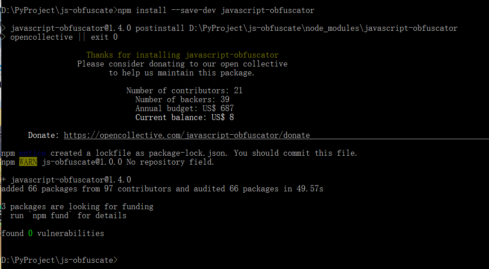
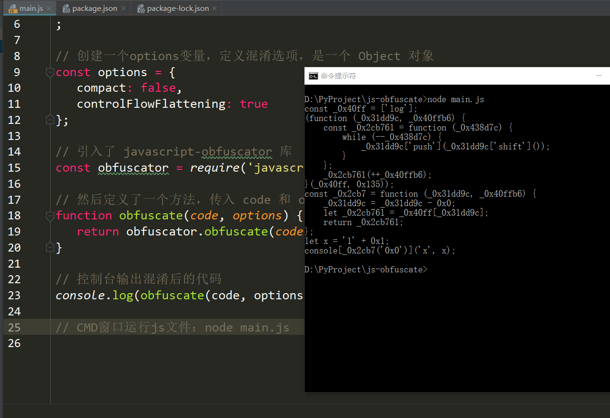

## javascript-obfuscator 库使用

# 1 javascript-obfuscator 安装启动
- 运行环境：Node.js 电脑直接搜索安装
- Node.js 介绍：
    - 简单的说 Node.js 就是运行在客户端的 JavaScript。
    - Node.js 语法和JavaScript几乎一样。
    - Node.js 是一个基于Chrome JavaScript 运行时建立的一个平台。
    - Node.js是一个事件驱动I/O服务端JavaScript环境，基于Google的V8引擎，V8引擎执行Javascript的速度非常快，性能非常好。
    - Node.js教程：https://www.runoob.com/nodejs/nodejs-tutorial.html
    - 安装了Node.js，使用node命令初始化一个项目，项目中的JavaScript文件就可以本地执行
    - CMD进入项目文件夹中，node main.js 就可以本地运行js文件

- 初始化项目
    - 1.新建一个文件夹，比如 js-obfuscate，随后CMD窗口进入该文件夹，初始化工作空间：
        - 执行命令：npm init
        - 
    - 2.然后根据提示输入一些配置信息，创建一个 package.json 文件
        - 参考图片
        - 参考网址npm init初始化项目配置信息说明：https://www.cnblogs.com/WD-NewDemo/p/11141384.html
        - 如果我们在进行package.json文件配置的时候写错了东西，或者后期要添加什么内容的话，我们是可以直接在项目的根目录中打开然后进行修改
    - 3.安装 javascript-obfuscator 这个库：
        - 当前 js-obfuscate 项目文件夹下执行命令
        - npm install --save-dev javascript-obfuscator
        - 
    - 4.pycharm软件打开 js-obfuscate 项目文件夹
        - 项目文件夹下创建 JavaScript 类型文件即可
        - 新建一个main.js文件，具体查看js-obfuscate项目文件夹
        - 然后CMD窗口切换到项目文件夹下执行运行命令：node main.js
        - 输出结果就是混淆后的代码
        - 
        - 混淆代码使用了控制流扁平化的选项，打乱函数原有代码执行流程及函数调用关系，使代码逻变得混乱无序
   
## 2 代码控制流平坦化和代码压缩
- 代码压缩
    - 参数 compact 即可完成 JavaScript 代码的压缩，输出为一行内容。
    - 默认是 true，如果定义为 false，则混淆后的代码会分行显示。
- 代码控制流平坦化
    - 参数 controlFlowFlattening ， 该参数默认不写，该混淆库默认就是开启的，最核心的功能
    - 打乱函数原有代码执行流程及函数调用关系，使代码逻变得混乱无序。
    - 该参数写不写，功能都是默认开启，设置true或false运行结果没啥区别
    - 设置true或false，混淆后代码一模一样

- 参考代码
    - main.js 原始 js 代码
    - main1.js 代码控制流扁平化(代码打乱重新编码)和代码不压缩一行
    - main2.js 代码控制流扁平化和代码压缩一行  

## 3 变量名混淆
- 变量名混淆可以通过配置 identifierNamesGenerator 参数实现，
- 我们通过这个参数可以控制变量名混淆的方式，
- 如 hexadecimal 则会替换为 16 进制形式的字符串，在这里我们可以设定如下值：
    - hexadecimal：将变量名替换为 16 进制形式的字符串，如 0xabc123。
    - mangled：将变量名替换为普通的简写字符，如 a、b、c 等。
    - 该参数默认为 hexadecimal。   